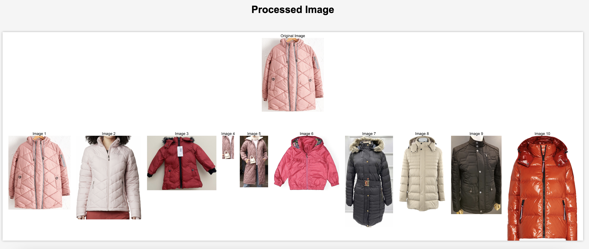

# Image Similartiy Finder

Image similarity finder is a service that finds similar images to given image by comparing their embeddings. I've used Google's pretrained vision transfomer [model](https://huggingface.co/google/vit-base-patch16-224) for extracting the embedding vectors and compared embedding vectors using cosine similarity function.

 The search space contains more than **40000** products of clothing and accessories.

To test the service easily, created an API which is running on a server and created a simple web page that calls this API as well. 

**You can test this service from [here.](http://13.68.155.12/)**

## Examples



 (Tried with my t-shirt :)

## Timings
Finding the most similar 10 images among 40000 images takes **~0.5 seconds** using an M1 Macbook with 8GB of memory. The process of downloading similar images, cropping and patching takes **around 2-3 seconds.** Therefore, total API call should take around 5-10 seconds (depending on connection speed as well).

## Running in Local
- Install requirements using the requirements.txt file. 
- Download required embedding vectors from this [link](https://drive.google.com/drive/folders/1fs3hcvQK36bWu7G88sBub2v1wGjiINfI?usp=sharing) and copy everything to the `data` folder.
- Then, to run the API, run the following command in the parent directory:

```uwsgi --ini api/api.ini --lazy```

API will start listening on port 8888. You can open the `index.html` with a web browser and run the process. 